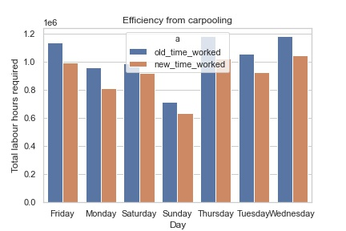
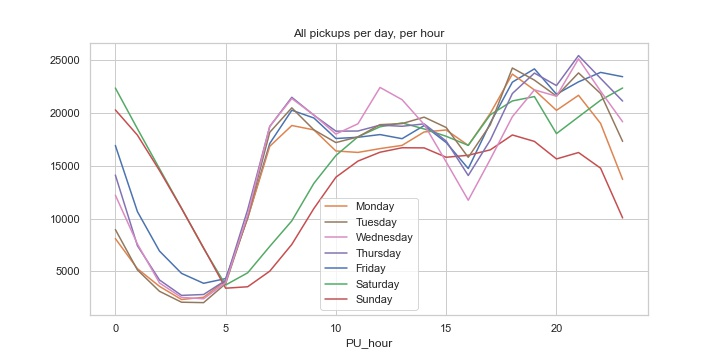
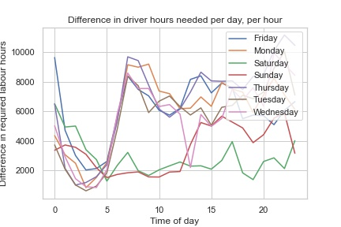

# Ride sharing data challenge

---
## Contents

[1. The problem](#problem)

[2. Approach](#approach)

[3. Evaluating the approach](#exa)

[4. Summary and Future Directions](#future)

---

# <a name="problem">The problem</a>

Please note: I have made the description of the problem and solution vague to make this notebook difficult to search for.

This projects was part of a short case study conducted as part of a job interview process. I examined the potential savings in labour hours that could be gained by pooling riders into vehicles through a ride sharing model. 

I used taxi data from a specific month in a specific year to implement my pooled vehicle rider algorithm and validate the approach.

# <a name="approach">Approach</a>

I proposed an algorithm which does the following:

- Group rides into time buckets
- Run k-means in each time bucket to obtain clusters of 'similar' ride requests within time buckets
- For each cluster, plan vehicle assignments and routes as follows:
    - Check whether the pickups or drop-offs are more *dispersed* 
    - Run TSP on whichever of the above is less *dispersed* (e.g. assume pick-ups are more dispersed, without loss of generality)
    - To assign passengers to vehicles, assign consecutive passengers in TSP solution to the same vehicle until the vehicle is full
    - Run a second TSP instance to determine drop-off order (without loss of generality)
    
    
### The following assumptions have been made:

- I assume drivers appear and disappear when required, and have not considered an optimal way of allocating drivers to the pooled rides identified in the algorithm. In other words, this approach ignores the problem of driver allocation by shift, thus also ignoring the scheduling problem that Via would have to solve to implement this approach.
- To calculate trip times, I have assumed that vehicles complete all trips at the average trip speed within each cluster. This ignores differences in speeds between highways/freeways and driving around slower parts of the city (e.g. driving through the middle of downtown).
- I have assumed that passengers are willing to wait over five minutes to be picked up by partitioning rides into 5-minute buckets, and then allowing for time to be picked up on top of those 5 minutes.
- The step of the algorithm that assigns passengers to vehicles ignores cases where a group of more than one passengers wish to ride together, and the current vehicle being assigned passengers cannot fit the whole group. Under the current algorithm, these parties would have to be spilt up instead of waiting for a taxi they could ride in together. This is probably not what passengers would choose to do, if given the option.
- I have approximated the time/distance to pick up and drop off passengers as $3d$ using the implicit assumption that the trip pickup and drop-off locations are uniformly distributed, which is not necessarily true. The approximation was found as follows:
    - Assuming $n$ locations are uniformly distributed, let $L_n^{*}$ be the solution to TSP on these $n$ locations. As $n \to \infty$, $L_n^{*}/\sqrt{n} \to \beta$, where the current upper bound on $\beta$ is a constant ($<1$). In our data set, the clusters tended to be quite large, so I assumed that the time required to pick up (or wlog drop off) passengers who are consecutive in a TSP solution within a cluster tends towards zero for larger values of $n$.
    - Without loss of generality, assume $d = d_{pu}$. Using a geometric argument \footnote{Not included here, but feel free to ask me!}, it can be shown that if we use euclidean distance (another assumption), I roughly approximate the distance required to drop passengers off by $3d$. (The total efficiency from the algorithm is very sensitive to this approximation, and the approximation is not correctly bounded.)

# <a name="exa">Evaluating the approach</a>

The figure below shows the number of driver labour hours used through carpooling (new time worked) compared to the number of driver labour hours used to meet the same demand (old time worked) in the yellow taxi data set over the same time period. Note that the aggregation performs roughly the same on average per day of the week.

First, note that we can observe that the difference between using/not-using aggregation is higher on weekdays than on weekends, particularly between 5am and noon, which are times when demand on weekend falls below the average weekday demand. This suggests that aggregation can lead to more efficient use of driver labour on weekdays, during the day, particularly during peak hours. 

Second, note that the following figure also reveals that  aggregation only leads to modest gains in efficiency between midnight and 5am, and on Saturdays, compared to other days and times. From these observations, we can conclude that an aggregation algorithm should be optimized to be most effective during peak hours, on workdays, since a rudimentary approach shows these time windows offer the highest potential savings in driver labour costs.

# <a name="future">Summary and Future Directions</a>

Using the approximations detailed above, this algorithm meets ridership demand using 6,356,147 hours of driver labour, which is an overall reduction of 8,72,571 hours over the hours of labour used to satisfy ridership demand with un-pooled rides.

Computationally intensive steps are performed on small data sets. k-means runs in $O(n^2)$, and we are only ever running k-means on the trips within each time bucket, so these k-means can be run independently (in parallel) if needed. TSP will also need to be run only once within each cluster within each time bucket, so although TSP is NP-hard, it runs independently on relatively small point sets. 

Clear next steps to improve this project include:
- Implementing TSP, or an approximation of TSP to calculate a tighter bound on the true cost savings made possible by the proposed algorithm.
- Exploring solutions which include intermediate pickups and dropoffs.
